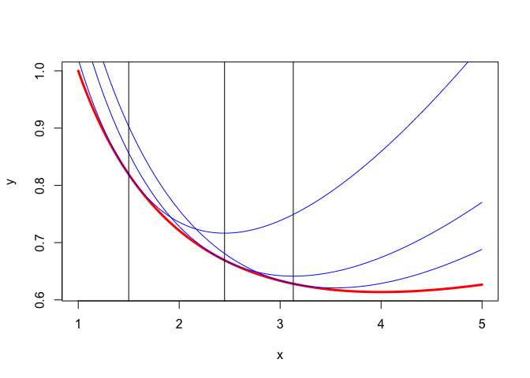

**Note:** This is a working manuscript which will be expanded/updated
frequently. All suggestions for improvement are welcome. All Rmd, tex,
html, pdf, R, and C files are in the public domain. Attribution will be
appreciated, but is not required. The files can be found at
<https://github.com/deleeuw> in the repositories smacofCode, smacofManual,
and smacofExamples.

\sectionbreak

# Introduction

In *Multidimensional Scaling (MDS)* the data consists of information
about the similarity or dissimilarity between pairs of objects selected
from a finite set $\mathcal{O}=\{o_1,\cdots,o_n\}$.

In *metric MDS* we have numerical dissimilarity measures $\delta$ on 
a subset of $\mathcal{O}\times\mathcal{O}$ and we want to
map the objects $o_i$ into $n$ points $x_i$ of some metric space in such
a way that the distances between the points approximate the
dissimilarities between the objects. In *smacof*, our framework for MDS
theory, algorithms, and computer programs, the metric space is
$\mathbb{R}^p$, the space of all $p$-tuples of real numbers, and the distance is the usual Euclidean distance. Thus we are looking for 
$x_i$, with $i=1,\cdots,n$, such that
\begin{equation}
\delta_{ij}:=\delta(o_i,o_j)\approx d_{ij}(X):=\sqrt{\sum_{s=1}^p(x_{is}-x_{js})^2}.
(\#eq:mdsdef)
\end{equation}
(the symbol $:=$ is used for definitions). Note that *distance matrix completion* (@fang_oleary_12) is an example of metric MDS.

Besides metric MDS there is also something called *non-metric MDS*. The terms is ambiguous and can mean either one of two things. One definition is that
we do not have numerical information about the dissimilarities, but only
ordinal of nominal information. In the ordinal case we know that some dissimilarities are larger or smaller than others, in the nominal case
that the objects are partitioned into groups and  within-group
distances are smaller than between-group distances. An MDS analysis
is also non-metric if we have numerical dissimilarities but we decide
to use only the ordinal or nominal information in the dissimilarities
as data for our MDS analysis. The data are a binary relation $\preceq_\delta$ on a subset of
$\mathcal{O}\times\mathcal{O}$. There is a second binary relation $\preceq_d$ on
$\mathbb{R}_+\times\mathbb{R}_+$. We want to find the configuration $X$
such that
\begin{equation}
(o_i,o_j)\preceq_\delta(o_k,o_l)\quad\Rightarrow\quad d_{ij}(X)\preceq_d d_{kl}(X).
(\#eq:relations)
\end{equation}
For most non-metric MDS problems both $\preceq_\delta$ and $\prec_d$ are partial orders, but for nominal data they can be equivalence relations.

The term "non-metric" is sometimes also used in the case in which we do have numerical dissimilarities $\delta_{ij}$, but the MDS problem is to find Euclidean distances which approximate some partially unknown function of the dissimilarities. The function should be member of a well-defined class of functions, for
instance a third degree polynomial or a piecewise linear spline on a
given knot sequence. The MDS technique not only finds the map of 
$\mathcal{O}$ into $\mathbb{R}^p$, but also chooses a function $f$
from the set $\mathfrak{D}$ to improve the approximation. 
\begin{equation}
f(\delta_{ij})\approx d_{ij}(X).
(\#eq:mdsnldef)
\end{equation}
Note that \@ref(eq:mdsnldef) implies that $f$ is applied to each 
dissimilarity separately. Thus $\mathfrak{D}$ consists of real-valued
functions of a single non-negative real variable.

To avoid confusion, we will refer to this class
of MDS techniques as *non-linear MDS*. This choice of terminology
has the unfortunately side-effect that $\mathfrak{D}$ in non-linear
MDS can be the set of all linear transformations. One important
example of this linear non-linear MDS is classical MDS with an 
additive constant (@messick_abelson_56). And, as another consequence, $\mathfrak{D}$ can also be the set of all monotone or all one-one transformations, in which case the non-linear MDS technique is also a non-metric MDS technique. And finally the set $\mathfrak{D}$ can have
only a single element, the identity transformation, in which case
non-linear MDS is metric MDS.

One way to solve this terminological dilemma is to simply define 
MDS as finding an approximate solution $(X,\Delta)$ to
\begin{subequations}
\begin{align}
\Delta&\in\mathfrak{D},(\#eq:gmdsdef1)\\
X&\in\mathfrak{X},(\#eq:gmdsdef2)\\
D(X)&=\Delta,(\#eq:gmdsdef3),
\end{align}
\end{subequations}
where $D(X)$ is the matrix of Euclidean distances and $\mathfrak{D}$ is the set of *transformed dissimilarities* in the non-linear case or the set of *quantified dissimilarities* in the non-metric case. We can then freely discuss
metric MDS, linear MDS, non-linear MDS, and non-metric MDS as special cases,
defined by different sets $\mathfrak{D}$.


# Loss Function

In the pioneering papers @kruskal_64a and @kruskal_64b the MDS problem
was formulated for the first time as minimization of an explicit *loss
function* or *badness-of-fit function*, which measures the quality of the approximation of the dissimilarities by the distances. To be historically accurate, we should
mention that the non-metric MDS technique proposed by @shepard_62a and @shepard_62b can be reformulated as minimization of an explicit loss function (see, for example, @deleeuw_E_17e). And the classical Young-Householder-Torgerson MDS technique (@torgerson_52) for metric MDS can be reformulated as minimizing an explicit least squares loss function (@deleeuw_heiser_C_82) as well.
But neither of these two predecessors was formulated originally as an explicit minimization
problem for a specific loss function

## Metric MDS

The loss function in least squares
metric Euclidean MDS is called *raw stress* 
and is defined as 
\begin{equation}
\sigma_R(X):=\frac12\mathop{\sum\sum}_{1\leq j<i\leq n}w_{ij}(\delta_{ij}-d_{ij}(X))^2.
(\#eq:stressdef)
\end{equation}
The subscript R in $\sigma_R$ stands for "raw", because we will discuss
other least squares loss functions for which we will also use the
symbol $\sigma$, but with other subscripts.

In definition
\@ref(eq:stressdef) the $w_{ij}$ are known non-negative *weights*, the
$\delta_{ij}$ are the known non-negative *dissimilarities* between
objects $o_i$ and $o_j$, and the $d_{ij}(X)$ are the *distances* between
the corresponding points $x_i$ and $x_j$. The summation is over all
pairs $(i,j)$ with $w_{ij}>0$. From now on we use "metric
MDS" to mean the minimization of $\sigma_R$.

The $n\times p$ matrix $X$, which has the coordinates $x_i$ of the $n$
points as its rows, is called the *configuration*, where $p$ is the
*dimension* of the Euclidean space in which we make the map. 
The metric MDS problem (of dimension $p$, for given $W$
and $\Delta$) is the minimization of \@ref(eq:stressdef) over the
$n\times p$ configurations $X$.

The weights $w_{ij}$ can be used to quantify information about the
precision or importance of the corresponding dissimilarities. Some of
the weights may be zero, which can be used to code *missing data*. If
all weights are positive we have *complete data*. If we have complete
data, and all weights are equal to one, we have *unweighted* metric MDS.
The pioneering papers by Shepard, Kruskal, and Guttman only consider the 
unweighted case. Weights were only introduced in MDS in @deleeuw_C_77. 

We assume throughout that the weights are *irreducible* (@deleeuw_C_77).
This means there is no partitioning of the index set
$I_n:=\{1,2,\cdots,n\}$ into subsets for which all between-subset
weights are zero. A reducible metric MDS problems decomposes into a
number of smaller independent metric MDS problems, so the irreducibility
assumption causes no real loss of generality.

The fact that the summation in \@ref(eq:stressdef) is over all $j<i$
indicates that the diagonal elements of $\Delta$ are not used (they are
assumed to be zero) and the elements above the diagonal are not used either
(they are assumed to be equal to the corresponding elements below
the diagonal). The somewhat mysterious factor $\frac12$ in definition
\@ref(eq:stressdef) is there because it simplifies some of the formulas
in later sections of this paper.

## Non-linear MDS


Kruskal was not really interested in metric MDS and the "raw" loss
function \@ref(eq:stressdef). His papers are really about non-metric
MDS, by which we mean least squares non-metric Euclidean MDS. Non-metric
MDS differs from metric MDS because we have incomplete information about
the dissimilarities. As we have seen, that if some dissimilarities are
missing metric MDS can handle this by using zero weights. In some
situations, however, we only know the rank order of the non-missing
dissimilarities. We do not know, or we refuse to use, their actual
numeric values. Or, to put it differently, even if we have numerical
dissimilarities we are looking for a *transformation* of the non-missing
dissimilarities, where the transformation is chosen from a set of
admissible transformations (for instance from all linear or monotone
transformations). If the dissimilarities are non-numerical, for example
rank orders or partitionings, we choose from the set of admissible
*quantifications*.

In non-metric MDS raw stress becomes 
\begin{equation}
\sigma_R(X,\Delta):=\frac12\sum w_{ij}(\delta_{ij}-d_{ij}(X))^2,
(\#eq:rawstressdef)
\end{equation} 
where $\Delta$ varies over the quantified or transformed
dissimilarities. In MDS parlance they are also called *pseudo-distances*
or *disparities*. Loss function \@ref(eq:rawstressdef) must be minimized
over both configurations and disparities, with the condition that the
disparities $\Delta$ are an admissible transformation or quantification
of the data. In Kruskal's non-metric MDS this means
requiring monotonicity. In this paper we will consider various other
choices for the set of admissible transformations. We will use the
symbol $\mathfrak{D}$ for the set of admissible transformations

The most familiar examples of  $\mathfrak{D}$ (linear,
polynomial, splines, monotone) define convex cones with apex at the origin. This
means that if $\Delta\in\mathfrak{D}$ then so is $\lambda\Delta$ for all
$\lambda\geq 0$. But consequently minimizing \@ref(eq:rawstressdef) over
all $\Delta\in\mathfrak{D}$ and over all configurations has the trivial
solution $\Delta=0$ and $X=0$, corresponding with the global minimum
$\sigma(X,\Delta)=0$. We need additional constraints to rule out this
trivial solution, and in non-metric MDS this is done by choosing a
*normalization* that keeps the solution away from zero.

Kruskal's original solution is to define *normalized stress* as
\begin{equation}
\sigma(X,\Delta):=\frac{\sum w_{ij}(\delta_{ij}-d_{ij}(X))^2}{\sum w_{ij}d_{ij}^2(X)}.
(\#eq:nstressdef)
\end{equation} 
To be precise, in Kruskal's formulation there are no weights,
and he actually takes the square root of \@ref(eq:nstressdef) to define
*Kruskal's stress*. The non-metric Euclidean MDS problem now is to minimize
loss function \@ref(eq:nstressdef) over all $n\times p$ configurations
$X$ and all admissible disparities $\Delta$.

## Non-metric MDS

## Normalization

Equation \@ref(eq:nstressdef) is only one way to normalize raw stress. 
Some obvious alternatives are discussed in detail in
@kruskal_carroll_69 and @deleeuw_U_75a. In the terminology of
@deleeuw_U_75a there are *explicit* and *implicit* normalizations.

In implicit normalization we minimize either 
\begin{equation}
\sigma(X,\hat D):=\frac{\sum  w_{ij}(\hat d_{ij} -d_{ij}(X))^2}{\sum   w_{ij}^{\ }\hat d_{ij}^2}
(\#eq:implicit1)
\end{equation} 
or 
\begin{equation}
\sigma(X,\hat D):=\frac{\sum   w_{ij}(\hat d_{ij}-d_{ij}(X))^2}{\sum   w_{ij}^{\ }d_{ij}^2(X) }
(\#eq:implicit2)
\end{equation} 
over $X$ and $\Delta\in\mathfrak{D}$.

As we have seen, @kruskal_64a chooses definition \@ref(eq:implicit2) and
calls the explicitly normalized loss function *normalized stress*. Note that we overload the symbol $\sigma$ to denote any one of the least squares loss
functions. It will always be clear from the text which $\sigma$ we are
talking about.

In explicit normalization we minimize the raw stress $\sigma_R(X,\hat D)$
from \@ref(eq:rawstressdef), but we add the explicit constraint 
\begin{equation}
\sum   w_{ij}^{\ }d_{ij}^2(X)=1,
(\#eq:explicit1)
\end{equation} 
or the constraint 
\begin{equation}
\sum   w_{ij}^{\ }\hat d_{ij}^2=1.
(\#eq:explicit2)
\end{equation} 
@kruskal_carroll_69 and @deleeuw_E_19d show that these
four normalizations all lead to essentially the same solution for $X$
and $\hat D$, up to scale factors dictated by the choice of the particular
normalization. It is also possible to normalize both $X$ and $\hat D$,
either explicitly or implicitly, and again this will give the same
solutions, suitably normalized. These invariance results assume the
admissible transformations form a closed cone with apex at the origin,
i.e. if $\hat D$ is admissible and $\lambda\geq 0$ then $\lambda\hat D$
is admissible as well. The matrices of Euclidean distances $D(X)$ form a
similar closed cone as well. The non-metric MDS problem is to find an element
of the $\hat D$ cone $\mathcal{D}$ and an element of the $D(X)$ cone where the angle between the two is a small as possible.

In the R version of smacof (@deleeuw_mair_A_09c,
@mair_groenen_deleeuw_A_22) we use explicit normalization
\@ref(eq:explicit2). This is supported by the result, also due to
@deleeuw_U_75a, that projection on the intersection of the cone of
disparities and the sphere defined by \@ref(eq:explicit2) is equivalent
to first projecting on the cone and then normalizing the projection (see
also @bauschke_bui_wang_18).

In the version of non-metric MDS discussed in this manual we need more flexibility. For algorithmic reasons that may become clear later on, we will go with the original \@ref(eq:nstressdef), i.e. with the implicitly normalized
Kruskal's stress. For the final results the choice between normalizations should not make a difference, but the iterative computations will be different for the
different choices.

## Some thoughts on ALS

The formulation in equations \@ref(eq:gdef1) and \@ref(eq:gdef2) neatly separates the
metric MDS part \@ref(eq:gdef1) and the transformation/quantification part \@ref(eq:gdef2).
This second part is also often called the *optimal scaling* part.

Equations \@ref(eq:gdef1) and \@ref(eq:gdef2) corresponds with the way most iterative non-linear and non-metric MDS 
techniques are implemented. The algorithms use *Alternating Least Squares* (ALS).
There have been quite a few ALS algorithms avant-la-lettre, but as far as I know both the name 
and ALS as a general approach to algorithm construction were first introduced in @deleeuw_R_68d, and then widely disseminated in a series of papers by
De Leeuw, Young, and Takane in the 1970's (work summarized in @young_deleeuw_takane_C_80 and @young_81).

In the ALS implementation of MDS two sub-algorithms are used in each iteration: one to improve the fit of the distances to the current disparities
$\Delta$ and one to improve the fit of the disparities to the current distances.
The two sub-algorithms define one major iteration of the MDS technique. In  formulas
(using superscript $(k)$ for major iteration number) we start with $(X^{(0)},\Delta^{(0)})$
and then alternate the mimization problems
\begin{subequations}
\begin{align}
X^{(k+1)}&\ni\{\sigma(X^{(k+1)},\Delta^{(k)})=\min_{X\in\mathfrak{X}}\sigma(X,\Delta^{(k)})\},\\
\Delta^{(k+1)}&\ni\{\sigma(X^{(k+1)},\Delta^{(k+1)})=\min_{\Delta\in\mathfrak{D}}\sigma(X^{(k+1)},\Delta)\},
\end{align}
\end{subequations}
where $\ni$ is short for "such that".
In MDS it is more realistic not to minimize loss in the sub-steps but merely to decrease it. Minimization in one or both of the two subproblems may itself require an infinite iterative method, which we have to truncate anyway. Thus
\begin{subequations}
\begin{align}
X^{(k+1)}\in\mathfrak{X}&\ni\{\sigma(X^{(k+1)},\Delta^{(k)})<\sigma(X^{(k)},\Delta^{(k)})\},\\
\Delta^{(k+1)}\in\mathfrak{D}&\ni\{\sigma(X^{(k+1)},\Delta^{(k+1)})<\sigma(X^{(k+1)},\Delta^{(k)})\}.
\end{align}
\end{subequations}


### The Single-Phase approach

In @kruskal_64a defines 
\begin{equation}
\sigma(X):=\min_{\hat D\in\mathfrak{D}}\ \sigma(\hat D,X)=\sigma(X,\hat D(X)),
(\#eq:project)
\end{equation} 
where $\sigma(\hat D,X)$ is defined by
\@ref(eq:implicit2). The minimum in \@ref(eq:project) is over admissible
transformations. In definition \@ref(eq:project) 
\begin{equation}
\hat D(X):=\mathop{\text{argmin}}_{\hat D\in\mathfrak{D}}\sigma(X, \hat D).
(\#eq:optscal)
\end{equation} 
Normalized stress defined by \@ref(eq:project) is now a
function of $X$ only. Under some conditions, which are true in Kruskal's
definition of non-metric MDS, there is a simple relation between the 
partials of \@ref(eq:implicit2) and those of \@ref(eq:project). 
\begin{equation}
\mathcal{D}\sigma(X)=\mathcal{D}_1\sigma(X,\hat D(X)),
(\#eq:partials)
\end{equation} 
where $\mathcal{D}\sigma(X)$ are the derivatives of
$\sigma$ from \@ref(eq:project) and $\mathcal{D}_1\sigma(X,\hat D(X))$
are the partial derivatives of $\sigma$ from \@ref(eq:implicit2) with
respect to $X$. Thus the partials of $\sigma$ from \@ref(eq:project) can
be computed by evaluating the partials of $\sigma$ from
\@ref(eq:implicit2) with respect to $X$ at $(X,\hat D(X))$. This has
created much confusion in the past. The non-metric MDS problem in Kruskal's original formulation is now to
minimize $\sigma$ from \@ref(eq:project), which is a function of $X$
alone.

@guttman_68 calls this the *single-phase approach*. A variation of
Kruskal's single-phase approach defines 
\begin{equation}
\sigma(X)=\sum w_{ij}(d_{ij}^\#(X)-d_{ij}(X))^2,
(\#eq:rankimage)
\end{equation}
where the $d_{ij}^\#(X)$ are *Guttman's rank images*, i.e. the
permutation of the $d_{ij}(X)$ that makes them monotone with the
$\delta_{ij}$ (@guttman_68). Or, alternatively, define
\begin{equation}
\sigma(X):=\sum   w_{ij}(d_{ij}^\%(X)-d_{ij}(X))^2,
(\#eq:shepard)
\end{equation}
where the $\hat d_{ij}^\%(X)$ are *Shepard's rank images*, i.e. the
permutation of the $\delta_{ij}$ that makes them monotone with the
$d_{ij}(X)$ (@shepard_62a, @shepard_62b, @deleeuw_E_17e).

Minimizing the Shepard or Guttman single-phase loss functions is
computationally more complicated than Kruskal's *monotone regression*
approach, mostly because the rank-image transformations are not
differentiable, and there is no analog of \@ref(eq:partials) and of the
equivalence of the different implicit and explicit normalizations.

### The Two-Phase Approach

The *two-phase approach* or *alternating least squares (ALS)* approach
alternates minimization of $\sigma(\hat D,X)$ over $X$ for our current
best estimate of $\hat D$ with minimization of $\sigma(\hat D,X)$ over
$\Delta\in\mathfrak{D}$ for our current best value of $X$. Thus an
update from iteration $k$ to iteration $k+1$ looks like 
\begin{subequations}
\begin{align}
\hat D^{(k)}&=\mathop{\text{argmin}}_{\hat D\in\mathfrak{D}}\sigma(\hat D,X^{(k)}),(\#eq:step1)\\
X^{(k+1)}&=\mathop{\text{argmin}}_X\sigma(\hat D^{(k)},X).(\#eq:step2)
\end{align} 
\end{subequations}
This ALS approach to MDS was in the air since the early
(unsuccessful) attempts around 1968 of Young and De Leeuw to combine
Torgerson's classic metric MDS method with Kruskal's monotone regression
transformation. All previous implementations of non-metric smacof use
the two-phase approach, and we will do the same in this paper.

As formulated, however, there are some problems with the ALS algorithm.
Step \@ref(eq:step1) is easy to carry out, using monotone regression.
Step \@ref(eq:step2) means solving a metric scaling problem, which is an
iterative proces that requires an infinite number of iterations. Thus,
in the usual implementations, step \@ref(eq:step1) is combined with one
of more iterations of a convergent iterative procedure for metric MDS,
such as smacof. If we take only one of these *inner iterations* the
algorithm becomes indistinguishable from Kruskal's single-phase method.
This has also created much confusion in the past.

In the usual implementations of the ALS approach we solve the first
subproblem \@ref(eq:step1) exactly, while we take only a single step
towards the solution for given $\hat D$ in the second phase
\@ref(eq:step2). If we have an infinite iterative procedure to compute
the optimal $\hat D\in\mathfrak{D}$ for given $X$, then a more balanced
approach would be to take several inner iterations in the first phase
and several inner iterations in the second phase. How many of each,
nobody knows. In our current implementation of smacof we take several
inner iteration steps in the first phase and a single inner iteration
step in the second phase.

# Smacof Notation and Terminology

We discuss some standard MDS notation, first introduced in
@deleeuw_C_77. This notation is useful for the second phase of the ALS
algorithm, in which solve the metric MDS problem of we minimizing
unnormalized $\sigma(X,\hat D)$ over $X$ for fixed $\hat D$. We will
discuss the first ALS phase later in the paper.

Start with the unit vectors $e_i$ of length $n$. They have a non-zero
element equal to one in position $i$, all other elements are zero. Think
of the $e_i$ as the columns of the identity matrix.

Using the $e_i$ we define for all $i\not= j$ the matrices
\begin{equation}
A_{ij}:=(e_i-e_j)(e_i-e_j)'.
\end{equation} 
The $A_{ij}$ are of order $n$, symmetric,
doubly-centered, and of rank one. They have four non-zero elements.
Elements $(i,i)$ and $(j,j)$ are equal to $+1$, elements $(i,j)$ and
$(j,i)$ are $-1$.

The importance of $A_{ij}$ in MDS comes from the equation
\begin{equation}
d_{ij}^2(X)=\text{tr}\ X'A_{ij}X.
(\#eq:dfroma)
\end{equation} 
In addition we use the fact that the $A_{ij}$ form a
basis for the $binom{n}{2}$-dimensional linear space of all
doubly-centered symmetric matrices.

Expanding the square in the definition of stress gives 
\begin{equation}
\sigma(X)=\frac12\{\sum   w_k\delta_k^2-2\ \sum   w_k\delta_kd_k(X)+\sum   w_kd_k^2(X)\}.
(\#eq:expand)
\end{equation} 
It is convenient to have notation for the three separate
components of stress from equation \@ref(eq:expand). Define
\begin{align}
\eta_{\hat D}^2&=\sum   w_{ij}\hat d_{ij}^2,(\#eq:condef)\\
\rho(X)&=\sum   w_{ij}\hat d_{ij}d_{ij}(X),(\#eq:rhodef)\\
\eta^2(X)&=\sum   w_{ij}d_{ij}(X)^2.(\#eq:etadef)
\end{align} 
which lead to 
\begin{equation}
\sigma(X)=\frac12\left\{\eta_{\hat D}^2-2\rho(X)+\eta^2(X)\right\}.
(\#eq:stressshort)
\end{equation} 
We also need 
\begin{equation}
\lambda(X)=\frac{\rho(X)}{\eta(X)}.
(\#eq:lambdadef)
\end{equation}

Using the $A_{ij}$ makes it possible to give matrix expressions for
$\rho$ and $\eta^2$. First 
\begin{equation}
\eta^2(X)=\text{tr}\ X'VX,
(\#eq:etamat)
\end{equation} 
with 
\begin{equation}
V:=\sum   w_{ij}A_{ij}.
(\#eq:vdef)
\end{equation} 
In the same way 
\begin{equation}
\rho(X)=\text{tr}\ X'B(X)X,
(\#eq:rhomat)
\end{equation} 
with 
\begin{equation}
B(X):=\sum   w_{ij}r_{ij}(X)A_{ij},
(\#eq:bdef)
\end{equation} 
with 
\begin{equation}
r_{ij}(X):=\begin{cases}\frac{\delta_{ij}}{d_{ij}(X)}&\text{ if }d_{ij}(X)>0,\\
0&\text{ if }d_{ij}(X)=0.
\end{cases}
\end{equation} 
Note that $B$ is a function from the set of $n\times p$
configurations into the set of symmetric doubly-dentered matrices of
order $n$. All matrices of the form $\sum x_{ij}A_{ij}$, where summation
is over all pairs $(i,j)$ with $j<i$, are symmetric and doubly-centered.
They have $-x_{ij}$ as off-diagonal elements while the diagonal elements
$(i,i)$ are $\sum_{j=1}^nx_{ij}$.

Because $B(X)$ and $V$ are non-negative linear combinations of the
$A_{ij}$ they are both positive semi-definite. Because $W$ is assumed to
be irreducible the matrix $V$ has rank $n-1$, with only vectors
proportional to the vector $e$ with all elements equal to one in its
null-space (@deleeuw_C_77).

Summarizing the results so far we have 
\begin{equation}
\sigma(X)=\frac12\{\eta_{\hat D}^2-\text{tr}\ X'B(X)X+\text{tr}\ X'VX\}.
(\#eq:sigmat)
\end{equation}

Next we define the *Guttman transform* of a configuration $X$, for given
$W$ and $\Delta$, as 
\begin{equation}
G(X)=V^+B(X)X,
(\#eq:gudef)
\end{equation} 
with $V^+$ the Moore-Penrose inverse of $V$. In our
computations we use 
\begin{equation}
V^+=(V+\frac{1}{n}ee')^{-1}-\frac{1}{n}ee'
\end{equation}
Also note that in the unweighted case with complete data $V=nJ$,
where $J$ is the centering matrix $I-\frac{1}{n}ee'$, and thus
$V^+=\frac{1}{n}J$. The Guttman transform is then simply
$G(X)=n^{-1}B(X)X$.

# Intermezzo: Explicit Normalization

$$
\sigma(X,\hat D)=\frac12\frac{\sum w_{ij}(\hat d_{ij}-d_{ij}(X))^2}{\sum w_{ij}d_{ij}^2(X)}
$$
Majorize

$$
\sigma(X,\hat D)\leq\frac12\frac{\eta^2(\hat D)-2\text{tr}\ X'V\overline{Y}+\text{tr}\ X'VX}{\text{tr}\ X'VX}=\frac{\omega(X,Y)}{\eta^2(X)}
$$
Stationary equations
$$
\eta^2(X)(VX-VG(Y))-\omega(X,Y)VX=V\{(\eta^2(X)-\omega(X,Y))X-\eta^2(X)\overline Y\}
$$
So at a minimum $X$ is proportional to $\overline{Y}$ or $X=\alpha\overline{Y}$ for some $\alpha$. For ... to be zero we must have
$$
\alpha(\alpha^2\eta^2(\overline Y)-(\eta^2(\hat D)-2\alpha\eta^2(\overline Y)+\alpha^2\eta^2(\overline Y))=\alpha^2\eta^2(\overline Y)
$$
which works out to be
$$
\alpha=\frac{\eta^2(\hat D)}{\eta^2(\overline Y)}
$$
$$
\hat X=\frac{\eta^2(\hat D)}{\eta^2(\overline Y)}\ \overline{Y}
$$
The minimum is equal to

$$
\frac{-\frac{(\eta^2(\overline Y))^2}{\eta^2(\hat D)}+\eta^2(\overline Y)}{\eta^2(\overline Y)}=1-\frac{\eta^2(\overline Y)}{\eta^2(\hat D)}
$$
Use homogeneity of the Guttman transform.

More generally suppose we update with 
$$
X=\overline Y+\alpha(Y-\overline Y)
$$ 
Write
$$
\omega(X,Y)=\eta^2(\hat D)+\text{tr}\ (X-\overline Y)'V(X-\overline Y)-\eta^2(\overline Y)
$$
Thus if $X(\alpha)=\overline Y+\alpha(Y-\overline Y)$ we have
$$
\omega(\alpha)=\eta^2(\hat D)+\alpha^2\text{tr}\ (Y-\overline Y)'V(Y-\overline Y)-\eta^2(\overline Y)
$$
and 
$$
\eta^2(\alpha)=\eta^2(\overline Y)+2\alpha\text{tr}\ (Y-\overline Y)'V\overline Y+\alpha^2\text{tr}\ (Y-\overline Y)'V(Y-\overline Y)
$$
$$
\omega(Y,Y)=\eta^2(\hat D)+\text{tr}\ (Y-\overline Y)'V(Y-\overline Y)-\eta^2(\overline Y)
$$
$$
\frac{\omega(\alpha)}{\eta^2(\alpha)}\leq\sigma(Y)
$$

# Properties of Smacof Loss

## Derivatives

The Euclidean distance function $d_{ij}$ from ... is not differentiable
at configurations $X$ with $x_i=x_j$. If $d_{ij}(X)>0$ then 
$$
\mathcal{D}\sigma(X)=\frac{1}{d_{ij}(X)}A_{ij}X
$$ 
If $d_{ij}(X)=0$ then $$
D_+d_{ij}(X,Y)=\lim_{\epsilon\downarrow 0}\frac{d_{ij}(X+\epsilon Y)-d_{ij}(X)}{\epsilon}=d_{ij}(Y)
$$ which is non-linear in $Y$, showing non-differentiability.

$$
D_+\sigma(X,Y)=\text{tr}\ Y'(V-B(X))X+\sum\{w_{ij}\delta_{ij}d_{ij}(Y)\mid d_{ij}(X)=0\}
$$ This form of the directional derivative is used by @deleeuw_A_84f to
show that two independent necessary conditions for a local minimum are
$(V-B(X))X=0$ and $d_{ij}(X)>0$ for all $(i,j)$ with
$w_{ij}\delta_{ij}>0$. 

### Gradient

$$
\mathcal{D}\sigma(X)=(V-B(X))X
$$ 
At a stationary point $B(X)X=VX$ or $V^+B(X)X=X$. Thus a necessary
condition for a local minimum is that $V^+B(X)$ has at least $p$
eigenvalues equal to one. @deleeuw_U_14b has shown that if
$V^+B(X)\lesssim I$ then actually $X$ is a global minimizer of stress.

$$
\rho(X)=\sum w_{ij}\delta_{ij}(X)
$$

$$
\nabla d_{ij}(X)=\begin{bmatrix}0\\
\frac{x_i-x_j}{d_{ij}(X)}\\0\\-\frac{x_i-x_j}{d_{ij}(X)}\\0\end{bmatrix}
$$

$$
\partial d_{ij}(X)=\left\{\begin{bmatrix}0\\
y\\0\\-y\\0\end{bmatrix}\mid y'y\leq 1\right\}.
$$

### Hessian

The results on the Hessian of stress are largely unpublished. So we
summarize them here in this manual, so they'll be even more unpublished.

$$
H_{st}(X):=\sum w_{ij}\frac{\delta_{ij}}{d_{ij}(X)}\left\{\frac{A_{ij}x_sx_t'A_{ij}}{d_{ij}^2(X)}\right\}
$$

$$
H_{st}(X)=\sum   w_{ij}\frac{\delta_{ij}}{d_{ij}^3(X)}(x_{is}-x_{js})(x_{it}-x_{jt})A_{ij}
$$ 
$$
\mathcal{D}_{st}\sigma(X)=\begin{cases}H_{st}(X)&\text{ if }s\not= t,\\
V-B(X)+H_{st}&\text{ if }s= t.
\end{cases}
$$ 
If $I_p$ is the identity matrix of order $p$, and $\otimes$ is the
Kronecker product, then $$
\mathcal{D}^2\sigma(X)=I_p\otimes(V - B(X))+ H(X)
$$ $$
\sum_{s=1}^p\sum_{t=1}^p y_s'H_{st}y_t=\sum w_{ij}\frac{\delta_{ij}}{d_{ij}(X)}\left\{\frac{(\text{tr} \ Y'A_{ij}X)^2}{d_{ij}^2(X)}\right\}\leq\sum w_{ij}\frac{\delta_{ij}}{d_{ij}(X)}\text{tr}\ Y'A_{ij}Y=\text{tr}\ Y'B(X)Y.
$$ 
Thus 
$$
0\lesssim H\lesssim I_p\otimes B(X),
$$ 
and 
$$
I_p\otimes (V-B(X))\lesssim\mathcal{D}^2\sigma(X)\lesssim I_p\otimes V
$$ 
At a local minimum of $\sigma$ 
$$
0\lesssim\mathcal{D}^2\sigma(X)\lesssim I_p\otimes V
$$ 
In comparing the lower bounds on $\mathcal{D}^2\sigma(X)$ in ... and
... @deleeuw_U_14b shows that $V-B(X)\gtrsim 0$ is sufficient for a
*global* minimum of stress (but far from necessary).

Also $$
\sum_{t=1}^p H_{st}y_t=\sum w_{ij}\frac{\delta_{ij}}{d_{ij}(X)}\left\{\frac{\text{tr}\ Y'A_{ij}X }{d_{ij}^2(X)}\right\}A_{ij}x_s
$$ If $Y=X$ then $H(X)y=(I_p\otimes B(X))x$ and thus
$$\mathcal{D}^2\sigma(X)x=(I_p\otimes V)x.$$ In the unweighted case this
means that $X$ is an eigenvector of $\mathcal{D}^2\sigma(X)$ with
eigenvalue $n$. Inequalities ... show that this is actually the largest
eigenvalue. Or $(I_p\otimes V)^+\mathcal{D}^2\sigma(X)\lesssim I$.

If $Y=XT$ with $T$ anti-symmetric then $\text{tr}\ Y'A_{ij}X=0$ then
thus $H(X)y=0$. Thus $$
\sum_{t=1}^p\mathcal{D}_{st}\sigma(X)y_t=(V-B(X))y_t
$$ which is zero if $\mathcal{D}\sigma(X)$ is zero. Thus at a stationary
point of stress $\mathcal{D}^\sigma(X)$ has $\frac12p(p-1)$ zero
eigenvalues.

There are several ways to think of the Hessian. The simplest one
(perhaps) is as an $np\times np$ symmetric matrix (corresponding to

column-major R vector of length $\frac12 np(np+1)$). This is what we
would use for a straightforward version of Newton-Raphson.

It is more elegant, however, to think of $H$ as a symmetric super-matrix
of order $p$, with as elements $n\times n$ matrices. And, for some
purposes, such as the pseudo-confidence ellipsoids in @deleeuw_E_17q, as
a super-matrix of order $n$ with as elements $p\times p$ matrices. Both
the super-matrix interpretations lead to four-dimensional arrays, the
first a $p\times p\times n\times n$ array, the second an
$n\times n\times p\times p$ array. The different interpretations lead to
different ways to store the Hessian in memory, and to different ways to
retrieve its elements. Of course we can write routines to transform from
one interpretation to another.

## Lagrangian

In our implementation of the smacof algorithm we minimize stress over
configurations with $\eta(X)=1$, or, equivalently,
$\sum w_{ij}d_{ij}^2(X)=1$. This means we do not look for $X$ with
$\mathcal{D}\sigma(X)=(V-B(X))X=0$, but we look for solutions of $$
(V-B(X))X-\lambda VX=0,\\
\text{tr}\ X'VX= 1.
$$ At the solution $$
\lambda=1-\rho(X)
$$ and $$
X = \frac{\Gamma(X)}{\eta(\Gamma(X))}
$$ Also it is necessary for a local minimum that $$
\Gamma(X)=\rho(X)X
$$ Because the Guttman transform is homogeneous of degree zero this
implies $$
\Gamma(\Gamma(X)=\Gamma(X),
$$ so although $X$ is not a fixed point of the Guttman transform,
$\Gamma(X)$ is.

The second order necessary condition is that $$
H(X)\gtrsim I_p\otimes (\rho(X)V - B(X))
$$ is positive

### Kuhn-Tucker Points

bozo

# Smacof Algorithm


### Introduction to Majorization

Majorization, these days better known as MM (@lange_16), is a general
approach for the construction of minimization algorithms. There is also
minorization, which leads to maximization algorithms, which explains the
MM acronym: minorization for maximization and majorization for
minimization.

Before the MM principle was formulated as a general approach to
algorithm construction there were some important predecessors. Major
classes of MM algorithms avant la lettre were the *EM Algorithm* for
maximum likelihood estimation of @dempster_laird_rubin_77, the *Smacof
Algorithm* for MDS of @deleeuw_C_77, the *Generalized Weiszfeldt Method*
of @vosz_eckhardt_80, and the *Quadratic Approximation Method* of
@boehning_lindsay_88. The first formulation of the general majorization
principle seems to be @deleeuw_C_94c.

Let's start with a brief introduction to majorization. Minimize a real
valued function $\sigma$ over $x\in\mathbb{S}$, where $\mathbb{S}$ is
some subset of $\mathbb{R}^n$. There are obvious extensions of
majorization to functions defined on more general spaces, with values in
any partially ordered set, but we do not need that level of generality
in this manual. Also majorization applied to $\sigma$ is minorization
applied to $-\sigma$, so concentrating on majorization-minimization and
ignoring minorization-maximization causes no loss of generality

Suppose there is a real-valued function $\eta$ on
$\mathbb{S}\otimes\mathbb{S}$ such that

```{=tex}
\begin{align}
\sigma(x)&\leq\eta(x,y)\qquad\forall x,y\in\mathbb{S},(\#eq:maj1)\\
\sigma(x)&=\eta(x,x)\qquad\forall x\in\mathbb{S}.(\#eq:maj2)
\end{align}
```
The function $\eta$ is called a *majorization scheme* for $\sigma$ on
$S$. A majorization scheme is *strict* if $\sigma(x)<\eta(x,y)$ for all
$x,y\in S$ withj $x\not=y$.

Define \begin{equation}
x^{(k+1)}\in\mathop{\text{argmin}}_{x\in\mathbb{S}}\eta(x,x^{(k)}),
(\#eq:majalg)
\end{equation} assuming that $\eta(\bullet,y)$ attains its (not
necessarily unique) minimum over $x\in\mathbb{S}$ for each $y$. If
$x^{(k)}\in\mathop{\text{argmin}}_{x\in\mathbb{S}}\eta(x,x^{(k)})$ 
then we stop.

By majorization property \@ref(eq:maj1) 
\begin{equation}
\sigma(x^{(k+1)})\leq\eta(x^{(k+1)},x^{(k)}).
\end{equation}
Because we did not stop update rule \@ref(eq:majalg) implies 
\begin{equation}
\eta(x^{(k+1)},x^{(k)})<\eta(x^{(k)},x^{(k)}).
\end{equation} 
and finally by majorization property \@ref(eq:maj1)
\begin{equation}
\eta(x^{(k)},x^{(k)})=\sigma(x^{(k)}).
\end{equation}

If the minimum in \@ref(eq:majalg) is attained for a unique $x$ then
$\eta(x^{(k+1)},x^{(k)})<\eta(x^{(k)},x^{(k)})$. If the majorization
scheme is strict then $\sigma(x^{(k+1)})<\eta(x^{(k+1)},x^{(k)})$. Under
either of these two additional conditions
$\sigma(x^{(k+1)})<\sigma(x^{(k)})$, which means that the majorization
algorithm is a monotone descent algorithm, and if $\sigma$ is bounded
below on $\mathbb{S}$ the sequence $\sigma(x^{(k)})$ converges.

Note that we only use the order relation to prove convergence of the
sequence of function values. To prove convergence of the $x^{(k)}$ we
need stronger compactness and continuity assumptions to apply the
general theory of @zangwill_69a. For such a proof the argmin in update
formula \@ref(eq:majalg) can be generalized to
$x^{(k+1)}=\phi(x^{(k)})$, where $\phi$ maps $\mathbb{S}$ into
$\mathbb{S}$ such that $\eta(\phi(x),x)\leq\sigma(x)$ for all $x$.

We give a small illustration in which we minimize $\sigma$ with
$\sigma(x)=\sqrt{x}-\log{x}$ over $x>0$. Obviously we do not need
majorization here, because solving $\mathcal{D}\sigma(x)=0$ immediately
gives $x=4$ as the solution we are looking for.

To arrive at this solution using majorization we start with
\begin{equation}
\sqrt{x}\leq\sqrt{y}+\frac12\frac{x-y}{\sqrt{y}},
(\#eq:sqrtmaj)
\end{equation} which is true because a differentiable concave function
such as the square root is majorized by its tangent everywhere.
Inequality \@ref(eq:sqrtmaj) implies \begin{equation}
\sigma(x)\leq\eta(x,y):=\sqrt{y}+\frac12\frac{x-y}{\sqrt{y}}-\log{x}.
(\#eq:examplemaj)
\end{equation} Note that $\eta(\bullet,y)$ is convex in its first
argument for each $y$. We have $\mathcal{D}_1\eta(x,y)=0$ if and only if
$x=2\sqrt{y}$ and thus the majorization algorithm is \begin{equation}
x^{(k+1)}=2\sqrt{x^{(k)}}
(\#eq:examplealg)
\end{equation} The sequence $x^{(k)}$ converges monotonically to the
fixed point $x=2\sqrt{x}$, i.e. to $x=4$. If $x^{(0)}<4$ the sequence is
increasing, if $x^{(0)}<4$ it is decreasing. Also, by l'Hôpital,
\begin{equation}
\lim_{x\rightarrow 4}\frac{2\sqrt{x}-4}{x-4}=\frac12
(\#eq:hopi1)
\end{equation} and thus convergence to the minimizer is linear with
asymptotic convergence rate $\frac12$. By another application of
l'Hôpital \begin{equation}
\lim_{x\rightarrow 4}\frac{\sigma(2\sqrt{x)})-\sigma(4)}{\sigma(x)-\sigma(4)}=\frac14,
(\#eq:hopi2)
\end{equation} and convergence to the minimum is linear with asymptotic
convergence rate $\frac14$. Linear convergence to the minimizer is
typical for majorization algorithms, as is the twice-as-fast linear
convergence to the minimum value.

This small example is also of interest, because we minimize a *DC
function*, the difference of two convex functions. In our example the
convex functions are minus the square root and minus the logarithm.
Algorithms for minimizing DC functions define other important subclasses
of MM algorithms, the *DC Algorithm* of Tao Pham Dinh (see @lethi_tao_18
for a recent overview), the *Concave-Convex Procedure* of
@yuille_rangarajan_03, and the *Half-Quadratic Method* of Donald Geman
(see @nikolova_ng_05 for a recent overview). For each of these methods
there is a huge literature, with surprisingly little non-overlapping
literatures. The first phase of the smacof algorithm, in which we
improve the configuration for given disparities, is DC, concave-convex,
and half-quadratic.

In the table below we show convergence of \@ref(eq:examplealg) starting
at $x=1.5$. The first column show how far $x^{(k)}$ deviates from the
minimizer (i.e. from 4), the second shows how far$\sigma(x^{(k)})$
deviates from the minimum (i.e. from $2-\log 4$). We clearly see the
convergence rates $\frac12$ and $\frac14$ in action.


```
## itel   1 2.5000000000 0.2055741244 
## itel   2 1.5505102572 0.0554992066 
## itel   3 0.8698308399 0.0144357214 
## itel   4 0.4615431837 0.0036822877 
## itel   5 0.2378427379 0.0009299530 
## itel   6 0.1207437506 0.0002336744 
## itel   7 0.0608344795 0.0000585677 
## itel   8 0.0305337787 0.0000146606 
## itel   9 0.0152961358 0.0000036675 
## itel  10 0.0076553935 0.0000009172 
## itel  11 0.0038295299 0.0000002293 
## itel  12 0.0019152235 0.0000000573 
## itel  13 0.0009577264 0.0000000143 
## itel  14 0.0004788919 0.0000000036 
## itel  15 0.0002394531 0.0000000009
```

The first three iterations are shown in the figure below. The vertical
lines indicate the value of $x$, function is in red, and the first three
majorizations are in blue.



### Majorizing Stress


# MDS topics not covered

- asymmetric MDS
- Non-Euclidean Distances
- Non-Least-Squares Loss Functions
- Rank Images
- Shepard
- McGee

# References
