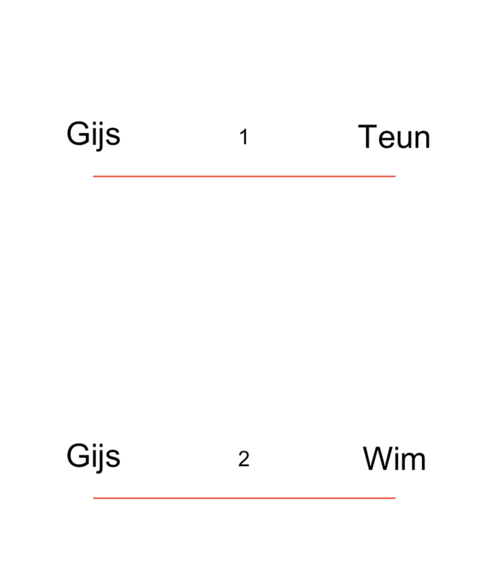

```{r loadpackages, echo = FALSE}
suppressPackageStartupMessages(library(smacofPC, quietly = TRUE))
```

```{r load code, echo = FALSE}
#source("~/Desktop/smacofProject/smacofCode/smacofPC/smacofPC.R")
```


**Note:** This is a working paper which will be expanded/updated
frequently. All suggestions for improvement are welcome. All Rmd, tex,
html, pdf, R, and C files are in the public domain. Attribution will be
appreciated, but is not required. The files can be found at
<https://github.com/deleeuw> in the smacofPC directory of the 
repositories smacofCode, smacofManual, and smacofExamples.

\sectionbreak

# Introduction

The paired comparison of pairs of objects is the simplest and
the most basic one of the cartwheel methods for collecting 
similarity judgments (@coombs_54). Pairs of objects from a set
$\mathcal{O}$ of $n$ objects are compared, and the responses of the subjects are 
that objects $o_i$ and $o_j$ are more similar than objects
$o_k$ and $o_l$. In the MDS context this means that we require
of our representation $X$ that $d_{ij}(X)\leq d_{kl}(X)$. The smacofPC()
function finds an approximate solution to this highly non-linear and
highly non-convex system of inequalities.

smacofPC() is not limited to data collected as comparisons of 
pairs of objects. Many different data collection methods produce data that are nt of this form, but can be
coded as such paired comparisons. Examples are the various versions of the
method of triads, the method of conditional rank orders, and the
complete or partial ranking of all $\binom{n}{2}$ dissimilarities.
In general the comparison data for pairs of pairs do not require transitivity
or symmetry and allow for replications of some or all pairs of
pairs.

There have been earlier versions of non-metric MDS methods based
on comparisons of pairs of objects. Around 1970 various people proposed the *positive orthant method (POM)* (@deleeuw_R_68g, @deleeuw_R_70a, @hartmann_79), the *absolute value principle (AVP)* (@guttman_69), and the
*pairwise method (PM)* (@johnson_73). Guttman's conference
presentation has been republished as @guttman_79.

All three methods use an implicitly normalized loss function with numerator
of the form
\begin{equation}
\lambda_N(X):=\sum\sum w_{ij,kl}\ \sigma_{ij,kl}\ \text{sign}(d_{ij}(X)-d_{kl}(X))|d_{ij}(X)-d_{kl}(X)|^q,
(\#eq:pom)
\end{equation}
where $w_{ij,kl}\geq 0$ and $\sigma_{ij,kl}$ is either minus one, plus one, or
zero. In most cases $\sigma_{ij,kl}$ is the signature of the dissimilarities, i.e.
\begin{equation}
\sigma_{ij,kl}=\text{sign}(\delta_{ij}-\delta_{kl}),
(\#eq:sijkl)
\end{equation}
but that is not necessarily the case because there may not be numerical dissimilarities. It is useful, however, to keep this interpretation in mind. In Johnson's PM squared distances instead of distances are used, but that at this conceptual level that seems just a minor detail.

The denominator of the loss function in all three approaches is
\begin{equation}
\lambda_D(X):=\sum\sum w_{ij,kl}|d_{ij}(X)-d_{kl}(X))|^q,
(\#eq:lambdad)
\end{equation}
and all three algorithms use gradient methods to minimize their loss functions
$\lambda(X)=\lambda_N(X)/\lambda_D(X)$.

In both AVP and the more recent version of POM (@deleeuw_E_18d) emphasis is on
$q=1$, in which case the loss function is
\begin{equation}
\lambda(X)=\frac{\sum\sum w_{ij,kl}\ \sigma_{ij,kl}(d_{ij}(X)-d_{kl}(X))}{\sum\sum w_{ij,kl}\ |d_{ij}(X)-d_{kl}(X)|}.
(\#eq:lambda1)
\end{equation}
This can be rewritten in the more compact and computationally more friendly *rearrangement form* 
\begin{equation}
\lambda(X)=\frac{\sum r_{ij}d_{ij}(X)}{\max_{r\in\mathcal{R}}\sum r_{ij}d_{ij}(X)}.
(\#eq:rearrange)
\end{equation}
Here $\mathcal{R}$ is the set of all matrices of the form $r_{ij}=\sum w_{ij,kl}\sigma_{ij,kl}$, with $\sigma_{ij,kl}$ varying over all possible 
signatures (or, equivalently, over the convex set of all matrices with entries between minus and plus one).

As we shall see, the loss function used in smacofPO is an explicitly normalized version of equation \@ref(eq:pom) with $q=2$. The loss function used for the initial estimate is an explicitly normalized version of equation \@ref(eq:pom) that has $q=1$ and uses squared distances.

# Loss Function

To introduce the smacofPO loss function we start with a general non-metric MDS problem with
loss function 
\begin{equation}
\sigma(X,\hat D_1,\cdots,\hat D_s):=\sum_{r=1}^R\sigma_r(X,\hat D_r),
(\#eq:stressdef)
\end{equation}
with
\begin{equation}
\sigma_r(X,\hat D_r):=\sum_{i=1}^n\sum_{j=1}^n w_{ijr}(\hat d_{ijr}-d_{ij}(X))^2.
(\#eq:rstressdef)
\end{equation}
As usual, the symbol $:=$ is used for definitions. 

The *weights* $W_r=\{w_{ijr}\}$ are known non-negative
numbers and $D(X):=\{d_{ij}(X)\}$ is a matrix of Euclidean distances
between the rows of the $n\times p$ *configuration* $X=\{x_{is}\}$, which are interpreted as $n$ points in $\mathbb{R}^p$.

Loss function \@ref(eq:stressdef) must be minimized over *configurations* $X$ and over the $R$ matrices of *disparities* $\hat D_r=\{\hat d_{ijr}\}$. The minimization problem has some constraints, both on $X$ and on the $\hat D_r$.
We require that $X\in\mathcal{X}\subseteq\mathbb{R}^{n\times p}$. Here $\mathcal{X}$ is the set of *column-centered* (columns add up to zero) $n\times p$ matrices that are *normalized* by
\begin{equation}
\sum_{i=1}^n\sum_{j=1}^n w_{ij}^\star d_{ij}^2(X))=1,
(\#eq:xscale)
\end{equation}
where
\begin{equation}
w_{ij}^\star:=\sum_{r=1}^R w_{ijr}.
(\#eq:wstardef)
\end{equation}

The *disparities* $\hat D_r=\{\hat d_{ijr}\}$ are required to satisfy $\hat D_r\in\mathcal{C}_r$. The $\mathcal{C}_r$ are polyhedral convex cones, which are subcones of the cone of non-negative matrices.  Each of the cones is defined by partial orders $\leq_r$ over the elements of the $\hat D_r$. In general, neither the (known) weight matrices $W_r$ nor the (unknown) disparity matrices $\hat D_r$ need to be symmetric and/or hollow (i.e. have zero diagonal). 

The *data* of the MDS problem are the weights $W_r$ and the cones $\mathcal{C}_r$. Each pair $(W_r,\mathcal{C}_r)$ is called a *slice* of the data. The *unknowns* or *parameters* of the problem are $X\in\mathcal{X}$ and the $\hat D_r\in\mathcal{C}_r$.

To minimize loss over $X\in\mathcal{X}$ for the current best value of the $\hat D_r$. This subproblem is simplified by using the least squares partitioning
\begin{equation}
\sigma(X,\hat D_1,\cdots,\hat D_s)=\sum_{r=1}^R\sum_{i=1}^n\sum_{j=1}^nw_{ijr}(\hat d_{ijr}-\hat d_{ij}^\star)^2+\sum_{i=1}^n\sum_{j=1}^nw_{ij}^\star(\hat d_{ij}^\star-d_{ij}(X))^2,
(\#eq:stresspart)
\end{equation}
where
\begin{equation}
\hat d_{ij}^\star=\frac{\sum_{r=1}^R w_{ijr}\hat d_{ijr}}{\sum_{r=1}^R w_{ijr}}.
(\#eq:deltastardef)
\end{equation}

## Slice-Independence

We will assume throughout that $w_{ijr}=w_{ij}\epsilon_{ijr}$, where
$\epsilon_{ijr}=1$ is either zero or one. If $\epsilon_{ijr}$ is one, we say that pair $(i,j)$ *participates* in slice $r$. Thus $\epsilon_{ijr}=0$ for all pairs that do not particpate. We refer to the assumption $w_{ijr}=w_{ij}\epsilon_{ijr}$ on the weights as the *slice-independent* case.

To see the consequences of slice-independence for our equations
we define
\begin{equation}
\mathcal{I}_r:=\{(i, j)\mid \epsilon_{ijr}= 1\}
(\#eq:irdef)
\end{equation}
so that
\begin{equation}
\sigma_r(X,\hat D_1,\cdots,\hat D_s)=\sum_{r=1}^s\sum_{(i,j)\in\mathcal{I}_r} w_{ij}(\hat d_{ijr}-d_{ij}(X))^2
(\#eq:stressdefred)
\end{equation}

Equation \@ref(eq:wstardef) gives $w_{ij}^\star=w_{ij}\epsilon_{ij}^\star,$
where $\epsilon_{ij}^\star$ is the number of times pair $(i,j)$ occurs in
the $R$ slices. A set of slices is *balanced* if all $\epsilon_{ij}^\star$ are equal. Also, from \@ref(eq:deltastardef), 
\begin{equation}
\hat d_{ij}^\star=\frac{\sum_{r=1}^R \epsilon_{ijr}\hat d_{ijr}}{\sum_{r=1}^R \epsilon_{ijr}}
(\#eq:deltastarsimp)
\end{equation}
which does not depend on the $w_{ij}$.

It follows that in our computations we have to deal with various
different sets of weights. There are the $w_{ijr}$, the $w_{ij}^\star$,
the $w_{ij}$, and the $\epsilon_{ij}^\star$. In the first ALS subproblem
where we minimize over the $\hat D_r$ for fixed $X$ we use
equation \@ref(eq:stressdefred), i.e. we use the $w_{ij}$. If we minimize over $X$ for fixed $\hat D_r$ we use \@ref(eq:stresspart), which means we
use $w_{ij}^\star=w_{ij}\epsilon_{ij}^\star$ and $\hat d_{ij}^\star$
given by \@ref(eq:deltastarsimp). Of course this all simplifies 
if $w_{ij}=1$ for all pairs $(i,j)$ (the *unweighted* case).

## Initial Configuration

In metric and non-linear MDS the default initial configuration is the
classical Torgerson metric MDS solution. That is not available for
smacofPC, because there are no numerical dissimilarities. In
@deleeuw_R_70a (section 5.1) and @deleeuw_B_73 (republished as @deleeuw_B_84), chapter 4, a different eigenvalue-eigenvector based initial solution is proposed. We discuss a somewhat modernized version here. It is sometime known as the *maximum sum method*.
The data are an order over a number of pairs of pairs. 
\begin{equation}
\omega(X):=\mathop{\sum\sum}_{(i,j)\prec(k,l)}(d_{ij}^2(X)-d_{kl}^2(X)),
(\#eq:omegadef)
\end{equation}
where $(i,j)\prec(k,l)$ means that we want $d_{ij}(X)\leq d_{kl}(X)$.
We want all terms in $\omega(X)$ to be positive, but for purposes of
the initial configuration we relax this to wanting their sum to be 
large. This explains the "maximum sum" name.

The sum \@ref(eq:omegadef) can be written as the quadratic form
$\omega(X)=\text{tr}\ X'A^\star X,$
with
\begin{equation}
A^\star:=\left\{\sum_{(i,j)}\sum_{(k,l)}(A_{ij}-A_{kl})\right\} 
(\#eq:astardef)
\end{equation}
Note that $A^\star$ is symmetric and doubly-centered. Moreover
its trace is zero, and consequently it has one zero, some negative, 
and some positive eigenvalues.

Because $X$ is column centered we have
$\omega(X)=\text{tr}\ X'(A^\star + \theta J)X$ where $J$ is the
centering matrix $I-n^{-1}ee'$ and $\theta$ is arbitrary. For
the non-zero eigenvalues we have
$\lambda_s(A^\star + \theta J))=\lambda_s(A^\star) + \theta,$
and thus for $\theta\geq-\lambda_{\text{min}}(A^\star)$ the matrix $A^\star + \theta J$ is positive semi-definite.

Of course maximizing $\omega$ over all $X$ does not make sense, because
by making $X$ larger we make $\omega$ larger. Thus the supremum over all
$X$ is $+\infty$ and the maximum is not attained. We need some
kind of normalization. The obvious choice is $\text{tr}\ X'X=1$, but
unfortunately that does not work. It gives a rank-one solution
with all columns of $X$ equal to the eigenvector corresponding with the
dominant eigenvalue of $A^\star$. Instead we use $\text{tr}\ (X'X)^2=1$.
This gives the solution $X=K\Lambda^\frac12$ with $\Lambda$ the largest $p$ eigenvalues of $A^\star$ (assumed to be non-negative) and $K$ the
corresponding normalized eigenvectors. This is our version of
the Torgerson initial solution for non-metric MDS.

We have been deliberately vague about what to do if the number of
positive eigenvalues of $A^\star$ is less than $p$, which is of
course a problem the Torgerson metric MDS solution has as well. In the
program we simply choose $\theta$ equal to $-\lambda_p(A^\star)$
if $\lambda_p(A^\star)<0$. We expect the problem to be rare, and
the actual choice of $\theta$ to be fairly inconsequential. 

Maximizing the maximum sum loss function is equivalent to minimizing
the loss function $\lambda_N(X)$ in \@ref(eq:pom) with $w_{ij,kl}=1$
and $q=1$ (and with squared distances instead of distances). The
maximum sum method was first proposed, together with POM, in @deleeuw_R_68g.
The inspiration came mostly from @guttman_46, so it is no surprise that
@guttman_69 proposes essentially the same initial configuration for his
AVP technique.

## Pairwise Monotone Regression

Suppose datum $r$ says that that $(i,j)\prec(k,l)$. In the slice independent case $w_{ijr}=w_{ij}$ and $w_{klr}=w_{kl}$
can be non-zero and all other elements of $W_r$ are zero. 

If $(i,j)\prec(k,l)$
\begin{equation}
\sigma_r(X,\hat D_r)=w_{ij}(\hat d_{ijr}-d_{ij}(X))^2+w_{kl}(\hat d_{klr}-d_{kl}(X))^2
(\#eq:lossr)
\end{equation}
Loss \@ref(eq:lossr) must be minimized over $\hat d_{ijr}\leq\hat d_{klr}$. If $d_{ij}(X)\leq d_{kl}(X)$
then $\hat d_{ijr}=d_{ij}(X)$ and $\hat d_{klr}=d_{kl}(X)$. Otherwise
\begin{equation}
\hat d_{ijr}=\hat d_{klr}=\frac{w_{ij}d_{ij}(X)+w_{kl}d_{kl}(X)}{w_{ij}+w_{kl}}.
(\#eq:opterr)
\end{equation}
Thus loss component \@ref(eq:lossr) is zero if the order of $d_{ij}(X)$ and $d_{kl}(X)$ is the same as the order dictated by the data
and 
\begin{equation}
\frac{w_{ij}w_{kl}}{w_{ij}+w_{kl}}(d_{ij}(X)-d_{kl}(X))^2
(\#eq:optloss)
\end{equation}
So far we have only considered the forced-choice situation in which
the subject has to choose one of the two pairs. If we allow for the alternative that $(i,j)$ and $(k,l)$ are equally similar then we can choose between two different approaches. In the *primary approach* we incur no loss for this pair, no matter what $d_{ij}(X)$ and $d_{kl}(X)$ are. In the *secondary approach* we require that $\hat d_{ijr}=\hat d_{klr}$ and consequently we use equation \@ref(eq:opterr) and add to the loss if
$d_{ij}X)\not= d_{kl}(X)$.

From equation \@ref(eq:optloss)  we see that the minimum of the loss function over $\hat D$ for given $X$ is the same as the numerator of Johnson's PM loss function (except that for PM all weights are one). 

# Program

## Parameters

The smacofPC function in R has the following parameters (with default values).

```{r params, eval = FALSE}
smacofPC <- function(data,
                     nobj = max(data),
                     ndim = 2,
                     wmat = NULL,
                     xold = NULL,
                     labels = NULL,
                     width = 15,
                     precision = 10,
                     itmax = 1000,
                     eps = 1e-10,
                     verbose = TRUE,
                     kitmax = 5,
                     keps = 1e-10,
                     kverbose = 0,
                     init = 1,
                     ties = 0)
```

* If xold is non-null then an initial configuration matrix must be provided.
* If labels is non-null then a character vector of plot labels must be provided.
* width and precision are relevant for the format of (optional) major iteration output.
* itmax and eps determine when the major iterations stop.
* If verbose = TRUE itel and stress for each major iteration are
written to stdout.
* kitmax and keps determine the number of inner Guttman transform iterations 
between two monotone regressions.
* If kverbose = TRUE then itel and stress for each inner iteration are written to stdout.
* If init = 1 the maximum sum initial configuration is computed, if init = 2 a random initial configuration is used.
* Ties is either 0, 1, or 2. If ties = 0 the data are forced choice, no ties
are allowed. If ties = 1 or ties = 2 the the primary or secondary approach
to ties is used.

## Input

The data are either a four column (if ties = 0) or a five column (if ties = 1
or ties = 2) matrix (or data frame). Here is an example of a data matrix
with ties = 2 from the hoogeveen example (see below). The first four columns are indices. Row one, for example,
tells us that $\delta_{23}\leq\delta_{34}$. Row two has an entry in the
fifth column and tells us that $\delta_{23}=\delta_{45}$, and that we
are supposed to use the second approach to ties, i.e. require
$\hat d_{23}=\hat d_{45}$.

```{r h0, echo = FALSE}
hoogeveen0 <-
structure(list(V1 = c(2L, 2L, 2L, 2L, 4L, 2L, 3L, 1L, 1L, 2L,
3L, 1L, 1L, 3L, 1L, 1L, 3L, 1L, 3L, 2L), V2 = c(3L, 3L, 3L, 3L,
5L, 5L, 5L, 3L, 2L, 5L, 5L, 3L, 2L, 5L, 5L, 3L, 5L, 5L, 5L, 5L
), V3 = c(3L, 4L, 3L, 2L, 1L, 1L, 4L, 1L, 2L, 2L, 3L, 2L, 2L,
2L, 1L, 3L, 1L, 1L, 2L, 2L), V4 = c(4L, 5L, 5L, 4L, 2L, 2L, 5L,
2L, 4L, 4L, 4L, 3L, 5L, 5L, 4L, 4L, 2L, 4L, 3L, 4L), V5 = c(0L,
2L, 0L, 0L, 0L, 2L, 0L, 0L, 0L, 0L, 0L, 0L, 0L, 0L, 0L, 0L, 0L,
0L, 2L, 0L)), class = "data.frame", row.names = c(NA, -20L))
hoogeveen0
```

* The data can have replications of some or all comparisons.
* The data are not necessarily consistent with any partial order, i.e. there can be intransivities and asymmetries.
* It is possible to use the secondary approach to ties for some comparisons
and the primary approach for others.
* For more information on data generation see section \@ref(utilities) on utilities.

## Algorithm

The smacofPO algorithm is standard alternating least squares, with one or
more Guttman transforms alternated with pairwise monotone regression.

## Output

```{r eval = FALSE}
  h <- list(
    nobj = nobj,
    ndim = ndim,
    snew = snew,
    itel = itel,
    xnew = xnew,
    dhat = dhat,
    dmat = dmat,
    wmat = wmat,
    esum = esum,
    wsum = wsum,
    labels = labels
  )
```

The member that may not be obvious are esum and wsum. esum is a matrix with the
$\epsilon_{ij}^\star$, and wsum is the elementwise product of esum and wmat.

# Utilities{#utilities}

## Data Generation and Collection

Let us first address the elephant in the room. Even for moderate $n$ there are a
lot of pairs of pairs, and it quickly becomes impossible to present all of them to
a subject, even if that subject is paid or is an undergraduate psychology student.

If we only consider distinct pairings of distinct pairs there are already
$\binom{\binom{n}{2}}{2}$
pairs of pairs, which is of the order $\frac14n^4$. Here is a little table.

```{r little, echo = FALSE}
for (i in 3:20) {
  cat(
    formatC(i, width = 4, format = "d"),
    formatC(choose(choose(i, 2), 2), width = 10, format = "d"),
    "\n")
}
```

There are a number of ways to deal with this fundamental problem. If we take the psychophysical point of view that subjects are merely replications then we
can use multiple subjects, each handling a subset of the pairs of pairs. 
Alternatively, we can select a random subset of the total set of pairs of pairs.
Or we could use a design to select a preferably balanced subset.

Two utility functions are included in the package to collect data and orginize them into the appropriate format. They are `smacofMakeAllPairs <- function(names, ties = 0)` and `smacofMakeRandomPairs <- function(names, nrandom, ties = 0)`.

Since 1897 Dutch children were taught to read using a
[leesplankje (reading board)](https://nl.wikipedia.org/wiki/Leesplankje_van_Hoogeveen), 
named after its originator, primary school teacher M.B. Hoogeveen.
It was still in use when I went to primary school in the nineteen
fifties. It probably has been replaced by more modern tools by now, and 
leesplankjes are now collectors items for boomers. A prototypical example is in figure \@ref(fig:hoogeveenjpg).

```{r hoogeveenjpg, echo=FALSE, out.width="50%", fig.cap="Hoogeveen's Leesplankje.", fig.align = "center"}

```

For our stimulus set we selected the five humans Wim, Zus, Jet, Teun, Gijs.
Starting smacofMakeAllPairs() generates a sequence of pairs of pairs on stdout,
giving the subject an opportunity to choose the most similar pair (or to
decide that both pairs are equally similar). On stdout we see (with responses)

```{r, eval = FALSE}
> smacofMakeAllPairs(names)
(Gijs,Teun) and (Gijs,Wim)
most similar pair: 2
(Teun,Wim) and (Gijs,Jet)
most similar pair: 2
(Gijs,Zus) and (Jet,Zus)
most similar pair: 2
(Wim,Jet) and (Gijs,Wim)
most similar pair: 1
(Teun,Zus) and (Teun,Jet)
most similar pair:
```

At the same time the same pairs are show on the graphics device, in the form shown in figure \@ref(fig:hoogeveenpng).

```{r hoogeveenpng, echo=FALSE, out.width="30%", fig.cap="Two Pairs of Pairs", fig.align = "center"}

```

This continues until all pairs of pairs are shown (in the case of
smacofMakeAllPairs()) or a given number of random pairs (without
replacement) has been shown (in the case of smacofMakeRandomPairs()).

As we discussed in the introduction smacofPC() is not limited to data
collected as pairs of pairs. After suitable manipulation it can also
handle data collected by the method of triads or by conditional or complete
rank orders. In particular if we have a matrix of
dissimilarities between $n$ objects we can convert it to a large number of comparisons of pairs of pairs. This is done by the function
`smacofMakePairsFromDelta <- function(delta, ties = 1)`.

Alternatively we can code the order of dissimilarities using only
$\binom{n}{2}-1$ pairs of pairs, by using only those pairs that are
consecutive in the ordering of pairs. This is done by
`smacofOrderPairsFromDelta <- function(delta, ties = 1)`.

## Plots

smacofPC does not have a Shepard plot, because there are no
dissimilarities to put on the horizontal axes. We do have
```{r confcode, eval = FALSE}
smacofConfigurationPlot <-
  function(h,
           main = "ConfigurationPlot",
           dim1 = 1,
           dim2 = 2,
           pch = 16,
           col = "RED",
           cex = 1.0)
```
and
```{r ddcode, eval = FALSE}
smacofDistDhatPlot <- function(h,
                               fitlines = TRUE,
                               colline = "RED",
                               colpoint = "BLUE",
                               main = "Dist-Dhat Plot",
                               cex = 1.0,
                               lwd = 2,
                               pch = 16)
```


# Examples

## Hoogeveen

A single subject (me) ran smacofMakeAllPairs() on the leesplankje names. This
produced 45 pairs of pairs.


```{r hooge, echo = FALSE}
names <- c("Wim", "Zus", "Jet", "Teun", "Gijs")
data <- read.table("/Users/deleeuw/Desktop/smacofProject/smacofExamples/smacofPC/hoogeveen/output.txt")
hhoogeveen <- smacofPC(data, labels = names, verbose = FALSE, ties = 0)
```

Convergence is to stress `r hhoogeveen$snew` in `r hhoogeveen$itel` iterations. The curved solution
Teun-Gijs-Wim-Jet-Zus goes from old-male to young-female. The 45 inequalities
in the data can be satisfied exactly.

:::: {.greybox data-latex=""}
::: {.center data-latex=""}
**INSERT FIGURE \@ref(fig:hoogeconf) ABOUT HERE**
:::
::::

:::: {.greybox data-latex=""}
::: {.center data-latex=""}
**INSERT FIGURE \@ref(fig:hoogedd) ABOUT HERE**
:::
::::


## Parties

I left The Netherlands in 1987 and have not followed their local political news. So I am not really an expert on current Dutch politics. Nevertheless I was the only subject generating the data (50 random pairs of pairs) for this example. The ten parties I used are

* SP Socialists
* GL Greens
* PvdD Party for the Animals
* PvdA Labour
* D'66 Neither fish nor fowl
* CDA Christian Democrats
* VVD European-style Liberals
* CU More Christian Democrats
* SGP Right-wing Christians
* FVD Right-wing Populists

For more details, see this [Wikipedia article](https://en.wikipedia.org/wiki/List_of_political_parties_in_the_Netherlands).


```{r parties,  echo = FALSE}
names <-
c("GL", "PvdA", "VVD", "D66", "CDA", "SP", "PvdD", "CU", "FVD",
"SGP")
data <- read.table("/Users/deleeuw/Desktop/smacofProject/smacofExamples/smacofPC/parties/output.txt")
hparties <- smacofPC(data, labels = names, verbose = FALSE, ties = 1)
```

Convergence is to stress `r hparties$snew` in `r hparties$itel` iterations. The solution is
in an almost equilateral triangle with the three extremes (FVD, SP, SGP) in the
vertices. The interior of the triangle shows a social democratic (PvdA, PvdD, GL),
a liberal (VVD, D'66), and a christian democrat (ARP, CU, CDA) cluster,
roughly ordered from left-wing on the right of the plot to right-wing on the left of the plot. Again, all 50 inequalities can be  fitted exactly.

We can check how sparse and balanced the randomly generated "design" is by printing the $\epsilon_{ij}^\star$.
```{r estar, echo = FALSE}
hparties$esum
```
with row sums `r rowSums(hparties$esum)`. For an all-pairs-of-pairs design the 
elements of this matrix would have been `r choose(10, 2) - 1`. So the random
"design" is very sparse but decently balanced.

:::: {.greybox data-latex=""}
::: {.center data-latex=""}
**INSERT FIGURE \@ref(fig:partiesconf) ABOUT HERE**
:::
::::

:::: {.greybox data-latex=""}
::: {.center data-latex=""}
**INSERT FIGURE \@ref(fig:partiesdd) ABOUT HERE**
:::
::::

## @ekman_54

The ekman data are dissimilarities between 14 colors. This means they can be 
expanded into `r choose(choose(14, 2), 2)` pairs of pairs, which can then be
analyzed by smacofPC(). We do not necessarily recommend this practice, because
the pairwise coding involves a great deal of dependence and redundancy.
The smacofPC() program is really intended for sequences of independent pairs of pairs judgments. Nevertheless we will use these expanded ekman dissimilarities as an example.

```{r ekmanfull, echo = FALSE}
data(ekman, package = "smacof")
ekman <- as.matrix(1 - ekman)
names <- row.names(ekman)
data <- smacofMakePairsFromDelta(ekman)
hekman <- smacofPC(data, labels = names, ties = 1, verbose = FALSE)
```

Convergence is to stress `r hekman$snew` in `r hekman$itel` iterations. The solution is the
familiar color circle, except that, for some reason that I do not understand yet, the circle is crumpled at the high frequency
end.

:::: {.greybox data-latex=""}
::: {.center data-latex=""}
**INSERT FIGURE \@ref(fig:ekmanconf) ABOUT HERE**
:::
::::

:::: {.greybox data-latex=""}
::: {.center data-latex=""}
**INSERT FIGURE \@ref(fig:ekmandd) ABOUT HERE**
:::
::::


# Figures

```{r hoogeconf, echo = FALSE, fig.align = "center", fig.cap = "Leesplankje"}
smacofConfigurationPlot(hhoogeveen, cex = .75)
```

```{r hoogedd, echo = FALSE, fig.align = "center", fig.cap = "Leesplankje"}
smacofDistDhatPlot(hhoogeveen, fitlines = TRUE)
```

```{r partiesconf, echo = FALSE, fig.align = "center", fig.cap = "Dutch political parties"}
smacofConfigurationPlot(hparties, cex = .75)
```

```{r partiesdd, echo = FALSE, fig.align = "center", fig.cap = "Dutch political parties"}
smacofDistDhatPlot(hparties, fitlines = TRUE)
```

```{r ekmanconf, echo = FALSE, fig.align = "center", fig.cap = "Ekman color data"}
smacofConfigurationPlot(hekman, cex = .75)
```

```{r ekmandd, echo = FALSE, fig.align = "center", fig.cap = "Ekman color data"}
smacofDistDhatPlot(hekman, fitlines = TRUE)
```


# References

